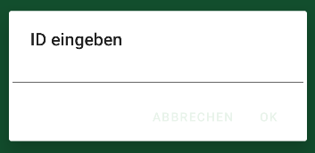
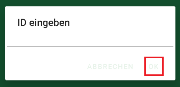
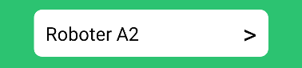
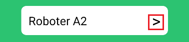
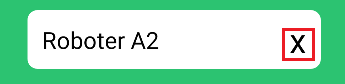
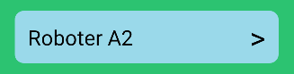
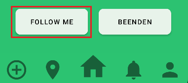
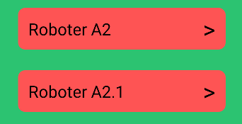
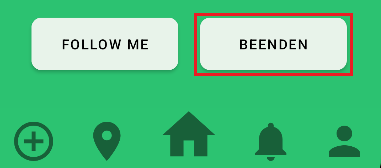

= Benutzeranleitung: FollowMe Android App
Hier finden Sie eine detaillierte Anleitung zur Verwendung der FollowMe Android App
:toc:
:toc-title: Inhaltsverzeichnis

<<<
== Einführung

=== Installation

=== Erste Schritte

Nach der Installation können Sie die App wie folgt verwenden:

1. Öffnen Sie die App durch Tippen auf das App-Symbol auf Ihrem Startbildschirm.

2. Melden Sie sich, mit den Ihnen von Ihrer Firma zur Verfügung gestellten Anmeldedaten, an.

3. Sie befinden sich nun auf der Startseite der App.

<<<

== Hauptfunktionen

=== Roboter hinzufügen

[NOTE]
====
Hinweis: Um einen Roboter hinzufügen zu können, sollten bereits Roboter, zu den zugehörigen Anmeldedaten, registriert sein.
====

Um einen Roboter hinzuzufügen, gehen Sie wie folgt vor:

[frame="none", grid="none", rowheight=10]
|===
|  |
|1. Tippen Sie auf das Hinzufügensymbol unten links auf der Startseite. | 

|2. Ein Eingabefenster öffnet sich, geben Sie die gewünschte ID des Roboters ein.
|

|3. Bestätigen sie ihre Eingabe mit "Ok".
|

|4. Der hinzugefügte Roboter wird im Homescreen angezeigt.
|
|===

[WARNING]
====
Warnung: Falls die ID schon hinzugefügt wurde oder der Roboter nicht exisitert, dann gibt die Anwendung entsprechend Rückmeldung und fügt den Roboter nicht hinzu. 
====

=== Roboter entfernen

[NOTE]
====
Hinweis: Um einen Roboter entfernen zu können, muss erst ein Roboter hinzugefügt werden. Der entfernte Roboter wird ausschließlich aus den im Moment verwendeten Robotern entfernt, jedoch nicht von den Anmeldedaten gelöscht.
====

Um einen Roboter zu löschen, gehen sie wie folgt vor:

[frame="none", grid="none"]
|===
|  |
|1. Tippen Sie auf das ">" Symbol des zu entfernenden Roboters.| 

|2. Das Symbol verändert sich, bestätigen sie den Vorgang in dem Sie es erneut andrücken.
|
|===

<<<

=== FollowMe Funktion

[NOTE]
====
Hinweis: Nachdem Sie Roboter hinzugefügt haben, können sie ihren FollowMe Status ändern.
Roboter die sie ausgewählt haben werden blau angezeigt, Roboter welche ihnen folgen werden [red]#rot# angezeigt, Roboter die sie markieren werden [blue]#blau# angezeigt.
====

Um Roboter folgen zu lassen, gehen sie wie folgt vor:

[frame="none", grid="none"]
|===
|  |
|1. Wählen sie einen Roboter aus in dem sie auf ihn klicken.| 

|2. Wenn sie alle Roboter die ihnen folgen sollen ausgewählt haben, drücken sie "Follow me".
|

|3. Die Liste wird gefiltert und es werden Ihnen alle Roboter angezeigt, die Ihnen folgen. Zusätzlich den Robotern, die Sie eben ausgewählt haben.
|
|===

[NOTE]
====
Hinweis: Sie können sich jetzt durch erneutes drücken von "Follow Me" wieder alle Roboter anzeigen lassen.
====

=== FollowMe Funktion Beenden

[NOTE]
====
Hinweis: Um ausgewählte Roboter nicht länger folgen zu lassen, sollten Ihnen bereits Roboter folgen, also [red]#rot# markiert sein.
====

Um Roboter nicht länger folgen zu lassen, gehen sie wie folgt vor:

[frame="none", grid="none"]
|===
|  |
|1. Öffnen sie die Liste der Roboter die ihnen folgen in dem sie "Follow me" anklicken.| 

|2. Die Liste der Roboter, welche Ihnen folgen, wird angezeigt.
|

|3. Wählen sie durch anklicken aus, welche Roboter ihnen nicht mehr folgen sollen. Die ausgewählten Roboter sind [blau]#blau# markiert.
|

| 4. Drücken sie "Beenden".
| 

| 5. Die Liste der Roboter, welche Ihnen folgen, wird angezeigt. Exklusive der Roboter, die Sie eben ausgewählt haben.
|
|===

=== Route anzeigen

[NOTE]
====
Hinweis: Um den aktuellen Stand der Route sowie Ihren aktuellen Standort zu sehen, können sie sich die Route anzeigen lassen.
====

Um die FollowMe Funktion zu visualisieren, gehen sie wie folgt vor:

[frame="none", grid="none"]
|===
|  |
|1. Tippen Sie auf das Nadelsymbol unten links in der Navigationsleiste.| 

|2. Es wird eine Karte mit ihrer aktuellen Position (Nadel) sowie der Route angezeigt.
|
|===

== Schlusswort

Das war eine kurze Einführung in die Verwendung Der FollowMe Android App. Wir hoffen, dass Sie die App genießen und von ihren Funktionen profitieren können.

Bei weiteren Fragen oder Anliegen wenden Sie sich bitte an unseren Kundensupport.
