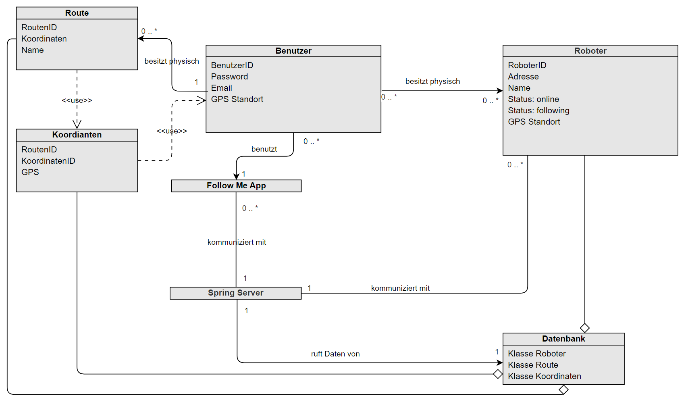
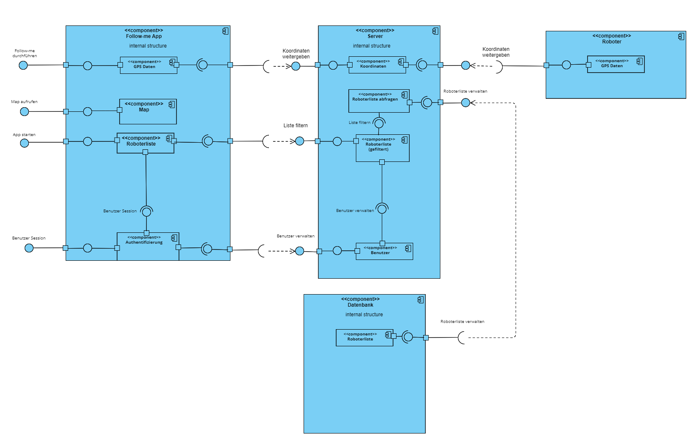
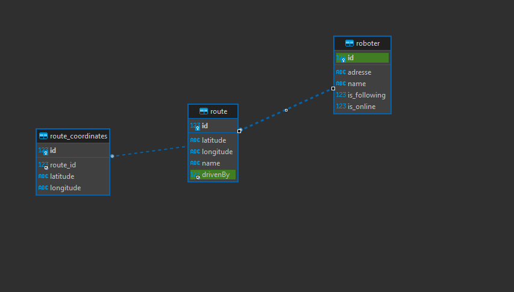
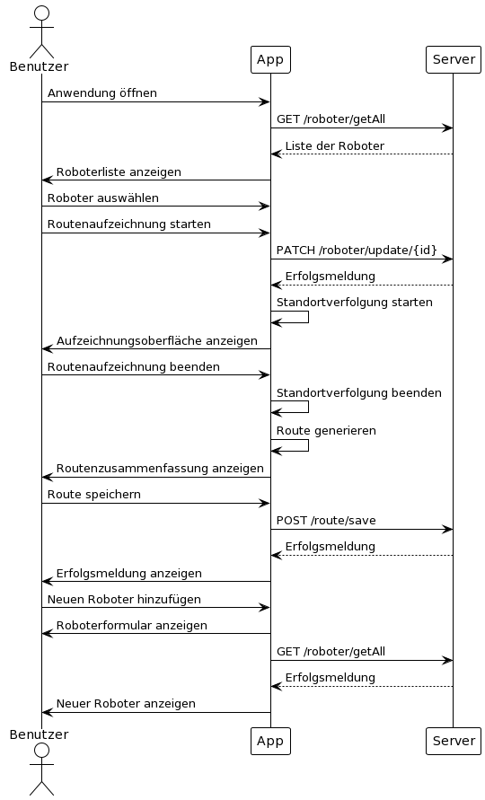

= Entwurfsdokumentationk: {project-name} [LL]
Leon Lowa <s83824@htw-dresden.de>;
{localdatetime}
include::../_includes/default-attributes.inc.adoc[]

== Zweck
Dieses Dokument soll künftige Entwickler bei der Weiterentwicklung des Systems unterstützen.

== Systemarchitektur
Logische Sicht:

Physische Sicht:

== Verwendete Bibliotheken/Frameworks
Es wurden folgende Bilbiotheken benutzt:
    
.plugins (Top level)
    id 'com.android.application' version '7.3.1'
    id 'com.android.library' version '7.3.1'
    id 'org.jetbrains.kotlin.android' version '1.7.0' 
    id 'org.jetbrains.dokka' version '1.8.20'

.plugins
    id 'com.android.application'
    id 'org.jetbrains.kotlin.android'
    id 'kotlin-android-extensions'
    id 'kotlin-android'
    id 'kotlin-kapt'
    id 'org.jetbrains.dokka'
    
.dependencies
    (Android App)
    implementation 'androidx.core:core-ktx:1.7.0'
    implementation 'androidx.appcompat:appcompat:1.5.1'
    implementation 'com.google.android.material:material:1.7.0'
    implementation 'androidx.constraintlayout:constraintlayout:2.1.4'
    implementation 'androidx.recyclerview:recyclerview:1.2.1'
    implementation 'androidx.cardview:cardview:1.0.0'
    implementation 'com.squareup.retrofit2:retrofit:2.9.0'
    implementation 'com.squareup.retrofit2:converter-gson:2.9.0'
    implementation 'com.google.android.gms:play-services-location:21.0.1'
    implementation 'androidx.preference:preference-ktx:1.2.0'
    implementation 'androidx.test:core-ktx:1.4.0'
    testImplementation 'junit:junit:4.13.2'
    androidTestImplementation 'androidx.test.ext:junit:1.1.4'
    androidTestImplementation 'androidx.test.espresso:espresso-core:3.5.0'
    implementation 'org.osmdroid:osmdroid-android:6.1.16'
    implementation "androidx.lifecycle:lifecycle-viewmodel-compose:2.5.1"
    implementation 'androidx.lifecycle:lifecycle-runtime-ktx:2.3.1'
    implementation 'androidx.activity:activity-compose:1.3.1'
    implementation "androidx.compose.ui:ui:1.2.0"
    implementation "androidx.compose.ui:ui-tooling-preview:1.2.0"
    implementation 'androidx.compose.material:material:1.2.0'
    implementation 'com.jakewharton.timber:timber:5.0.+'
    implementation 'org.greenrobot:eventbus:3.2.0'
    implementation 'androidx.recyclerview:recyclerview-selection:1.1.0'
    implementation "androidx.test.espresso:espresso-core:3.5.1"
    implementation "androidx.test.espresso:espresso-contrib:3.5.1"
    implementation "org.jetbrains.dokka:android-documentation-plugin:1.8.20"
    implementation "org.jetbrains.dokka:mathjax-plugin:1.8.20"

    (Rest API)
    runtimeOnly 'com.mysql:mysql-connector-j'n
    testImplementation 'org.springframework.boot:spring-boot-starter-test'
    implementation group: 'mysql', name: 'mysql-connector-java', version: '8.0.31'

.Frameworks
    id 'org.springframework.boot' version '3.0.1'
    id 'io.spring.dependency-management' version '1.1.0'
    implementation 'org.springframework.boot:spring-boot-starter-data-jpa' 
    implementation 'org.springframework.boot:spring-boot-starter-web'
	

== Datenbankschema

== Schnittstellen

.Rest-API
    Es wird eine Rest-API als Schnittstelle zwischen der MySQL Datenbank und der Android App benutzt.
    Diese dient der Speicherung, Veränderung und Löschung der Routen und Robotern.
    Als Framework wird Springboot benutzt, siehe Frameworks. Für weitere Informationen siehe Softwaredokumentation der Rest-API.

== Komponenten

//// 
@startuml
!theme plain
actor Benutzer

Benutzer -> App: Anwendung öffnen
App -> Server: GET /roboter/getAll
Server --> App: Liste der Roboter
App -> Benutzer: Roboterliste anzeigen

Benutzer -> App: Roboter auswählen
Benutzer -> App: Routenaufzeichnung starten
App -> Server: PATCH /roboter/update/{id}
Server --> App: Erfolgsmeldung
App -> App: Standortverfolgung starten
App -> Benutzer: Aufzeichnungsoberfläche anzeigen

Benutzer -> App: Routenaufzeichnung beenden
App -> App: Standortverfolgung beenden
App -> App: Route generieren
App -> Benutzer: Routenzusammenfassung anzeigen

Benutzer -> App: Route speichern
App -> Server: POST /route/save
Server --> App: Erfolgsmeldung
App -> Benutzer: Erfolgsmeldung anzeigen

Benutzer -> App: Neuen Roboter hinzufügen
App -> Benutzer: Roboterformular anzeigen
App -> Server: GET /roboter/getAll
Server --> App: Erfolgsmeldung
App -> Benutzer: Neuer Roboter anzeigen

@enduml
////