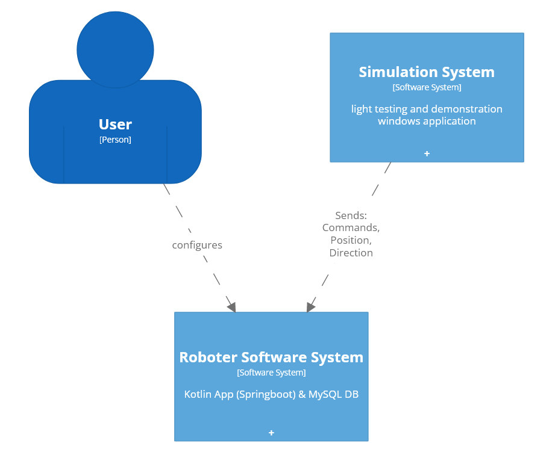
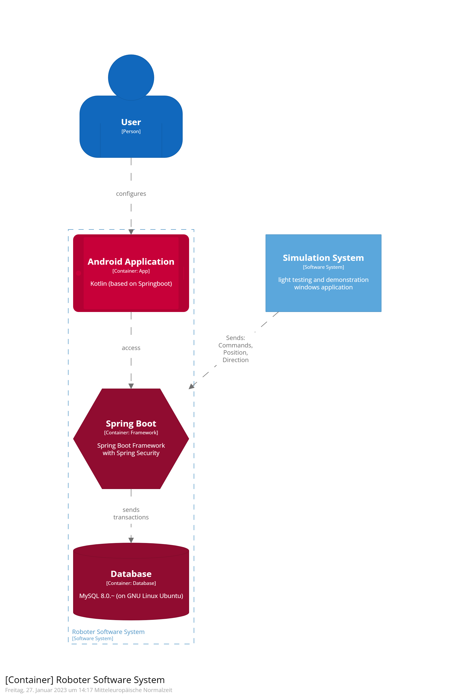
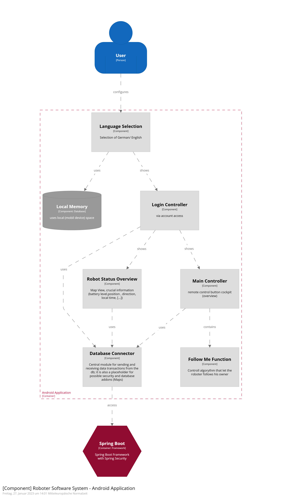

= Architecture Notebook: {project-name}
Vorname Nachname <email@domain.org>; Vorname2 Nachname2 <email2@domain.org>; Vorname3 Nachname3 <email3@domain.org>
{localdatetime}
include::../_includes/default-attributes.inc.adoc[]
// Platzhalter für weitere Dokumenten-Attribute

== Zweck
Dieses Dokument beschreibt die Philosophie, Entscheidungen, Nebenbedingungen, Begründungen, wesentliche Elemente und andere übergreifende Aspekte des Systems, die Einfluss auf Entwurf und Implementierung haben.

//Hinweise: Bearbeiten Sie immer die Abschnitte 2-6 dieser Vorlage. Nachfolgende Abschnitte sind empfohlen, aber optional und sollten je nach Umfang der künftigen Wartungsarbeiten, Fähigkeiten des Entwicklungsteams und Bedeutung anderer architektureller Belange.

//Anmerkung: Die Architektur legt wesentliche EINSCHRÄNKUNGEN für den Systementwurf fest und ist ein Schlüssel für die Erfüllung nicht funktionaler Eigenschaften!

== Architekturziele und Philosophie

Das System besteht aus einer Android-App. Sie dient dem Nutzer, als grafische Oberfläche um Aktionen durchzuführen und Entscheidungen zu treffen. Außerdem übermittelt sie im Hintergrund die nötigen Daten an den Server. Ein Simulationssystem, welches zu Testzwecken benötigt wird und einem Server, der GPS-Tracks speichert sowie Daten durch die Anwendung empfängt und diese an den jeweiligen Roboter weiterleitet. Er dient als Schnittstelle der Akteure. Um die Roboter zu synchronisieren, muss diesem einmalig ein Token von einem Admin zugewiesen werden. Die App soll nicht im Play Store veröffentlicht werden und vorerst nur von einer Person genutzt werden, aber nahezu rund um die Uhr verfügbar sein und später auch Mehrbenutzerbetrieb ermöglichen. Bei den verwendeten Endgeräten handelt es sich um Android Smartphones, die über einen Touchscreen bedient werden. Die technische Ausstattung (Bildschirmgröße, RAM, CPU, Bandbreite) sowie die genaue Android-Version sind unbekannt. Ausgegangen wird für die Entwicklung von der derzeit gängigen Android Version 11.

Für den Server wird ein Ubuntu Server mit einer MySQL basierten Datenbank verwendet. Er muss auch außerhalb des HTW-Netzes erreichbar sein. 

Die App soll eine möglichst intuitive Benutzeroberfläche besitzen und in Aktionen durch bekannte Icons oder Begriffe einfach beschrieben werden.

Das System ist die initiale Version und wird vermutlich im Laufe der Zeit noch hinsichtlich verschiedener Aspekte erweitert werden. Dazu gehören z.B. die Optimierung des Mehrbenutzerbetriebs und die Erweiterung der angebotenen Routenoptionen.

//Hinweise: Beschreiben Sie die Philosophie der Architektur, d.h. den zentralen Ansatz für ihre Architektur. Identifizieren Sie alle Aspekte, die die Philosophie beeinflussen, z.B. komplexe Auslieferung Aspekte, Anpassung von Altsystemen oder besondere Geschwindigkeitsanforderungen. Muss es besonders robust sein, um eine langfristige Wartung und Pflege zu ermöglichen?

//Formulieren Sie eine Reihe von Zielen, die die Architektur in ihrer Struktur und ihrem Verhalten erfüllen muss. Identifizieren Sie kritische Fragen, die von der Architektur adressiert werden müssen, z.B. besondere Hardware-Abhängigkeiten, die vom Rest des Systems isoliert werden sollten oder Sicherstellung der Funktionsfähigkeit unter besonderen Bedingungen (z.B. Offline-Nutzung).

== Annahmen und Abhängigkeiten

Annahmen: ::

* Auf dem Smartphone des Benutzers ist eine der neuesten Android Versionen installiert 
* Der Benutzer besitzt eine stabile GPS-Verbindung.
* Der Benutzer besitzt eine stabile Internetverbindung.
* Der Benutzer hat der App alle benötigten Berechtigungen erteilt.
* Die verwendeten Frameworks und APIs funktionieren nahezu fehlerfrei und werden in Zukunft gepflegt.

Abhängigkeiten: ::

* Wir sind drauf angewiesen, dass der Kartendaten Provider weiter kostenlos Kartendaten zur Verfügung stellt und nahezu rund um die Uhr erreichbar ist.
* Wir sind von einem Rechenzentrum abhängig, da der Server zur Synchronisation jederzeit zur Verfügung stehen muss.
* Wir sind darauf angewiesen, dass alle eingesetzten Frameworks und APIs gepflegt werden.

//[List the assumptions and dependencies that drive architectural decisions. This could include sensitive or critical areas, dependencies on legacy interfaces, the skill and experience of the team, the availability of important resources, and so forth]

== Architektur-relevante Anforderungen

Functional: ::
* SWFA-1: Die GPS-Tracks müssen dauerhaft gespeichert und bei Bedarf aktualisiert sein. Wenn ein aufgenommener GPS-Track hochgeladen wird, ist dieser dann dauerhaft verfügbar 
* SWFA-2: Während der Nutzung der App muss dauerhaft eine Internetverbindung bzw. Verbindung zum Server bestehen. 

Effizienz (Perfomance): ::

* NFAP-2: Gewählte Aktionen der App sollen innerhalb von 1000 Millisekunden an den Server gesendet, verarbeitet und verifiziert werden.

* NFAP-3: Die Speicherung der Daten auf dem Server soll nicht länger als 5 Sekunden dauern

Wartbarkeit (Supportability): ::
* NFAS-1: Die App soll entwicklungsrelevante Systemfehler loggen und an die Entwickler schicken

//Fügen Sie eine Referenz / Link zu den Anforderungen ein, die implementiert werden müssen, um die Architektur zu erzeugen.

== Entscheidungen, Nebenbedingungen und Begründungen
//[List the decisions that have been made regarding architectural approaches and the constraints being placed on the way that the developers build the system. These will serve as guidelines for defining architecturally significant parts of the system. Justify each decision or constraint so that developers understand the importance of building the system according to the context created by those decisions and constraints. This may include a list of DOs and DON’Ts to guide the developers in building the system.]

. Wir werden einen Linux Server mit Ubuntu Distribution nutzen, da dieser im Vergleich zu anderen Serverarten relativ schnell aufsetzbar ist und dadurch eine Zeitersparnis mit sich bringt. Wir haben bereits Vorkenntnisse zur Aufsetzung eines solchen Servers. Eine hohe Entwicklerbasis ist ebenfalls von Vorteil, da wir bei auftretenden Problemen auf bereits gewonnene Erfahrung anderer Programmierer zurückgreifen können. So kann der Entwicklungsprozess deutlich beschleunigt werden.

. Als Framework werden wir auf Springboot zurückgreifen. Mit der einfachen Syntax ist Springboot optimal geeignet für kleine bis mittlere Projekte. Bei der Nutzung ist vieles automatisiert (XML Dateien) und ebenfalls sehr einfach aufzusetzen. Es ist modern, für unseren Bedarf sehr flexibel einsetzbar und durch die Vorkenntnisse in Gradle das passende Framework für unsere App.

. Springboot inkludiert Spring Security, welches wir als Datenbankschnittstelle nutzen werden. Es ermöglicht eine sichere Kommunikation der App mit der Datenbank als Server. Dadurch wird der Datenschutz des Nutzers gewährleistet.

. Wir werden eine relationale Datenbank verwenden, da es für die von uns gespeicherten Daten
vorteilhaft ist. Relationale Datenbanken sind für unser System schnell genug, laufen stabiler
und haben eine höhere Datenintegrität als nicht-relationale Datenbanken.

. Als Datenbankmanagementsystem nutzen wir MySQL. Durch Vorerfahrungen mit diesem System wird es erleichtert, die gewünschten Daten zu erhalten und zu verarbeiten.

. Der Wunsch des Kunden war es, die App auf einem möglichst aktuellem Android Betriebssystem laufen zu lassen. Wir haben uns für die Android-Version 11 als Programmiergrundlage geeinigt, da diese weitverbreitet ist und der größte Teil aller Android Geräten diese Version unterstützen. Bei älteren Android-Versionen kann es daher zu Kompatibilitätsproblemen führen, da keine Optimierung für Vorversionen durchgeführt wird.

. Da wir aktuell keinen Zugriff auf Roboter haben und ebenfalls nicht bekannt ist, wie diese anzusteuern sind, entwickeln wir eine einfache zusätzliche Simulationssoftware, die es uns ermöglicht, die gewünschten verfügbaren Funktionen zu überprüfen und zu testen.

== Architekturmechanismen
https://www2.htw-dresden.de/~anke/openup/core.tech.common.extend_supp/guidances/concepts/arch_mechanism_2932DFB6.html[Doku "Concept: Architectural Mechanism"]
//[List the architectural mechanisms and describe the current state of each one. Initially, each mechanism may be only name and a brief description. They will evolve until the mechanism is a collaboration or pattern that can be directly applied to some aspect of the design.]

//Beispiele: relationales DBMS, Messaging-Dienste, Transaktionsserver, Webserver, Publish-Subscribe Mechanismus

//Beschreiben Sie den Zweck, Eigenschaften und Funktion der Architekturmechanismen.

. Da das System möglichst vielfältig einsetzbar sein soll, werden wir zu Beginn die Sprachen Englisch und Deutsch unterstützen. Die Einbindung von weiteren
Sprachen wird bei der Programmierung bedacht und soll in Zukunft leicht möglich sein.

. In der Analyse haben wir erfasst, dass die Routendaten persistent gespeichert werden müssen. 
Im Entwurf entschieden wir auf dieser Grundlage, dass alle Daten zentral in einer MySQL Server Datenbank gespeichert werden. Diese eignet sich gut für die von uns zu speichernden Daten und unsere Teammitglieder haben bereits Erfahrung mit diesem Datenbankmanagementsystem.

. Unser Datenbankserver wird ein zugehöriger Server des Laborbereichs der HTW Dresden sein. Wir haben uns dabei für einen Linux Ubuntu Server entschieden, da wir bereits Vorkenntnisse zum Aufsetzen eines solchen Servers besitzen. Es gibt eine sehr hohe Entwicklerbasis, sodass wir bei Problemfällen auf bereits gewonnene Erfahrung anderer Programmierer zurückgreifen können.
Falls Unstimmigkeiten oder längere Wartezeiträume entstehen, besteht die Option einen Server privat aufzusetzen oder zu mieten.

. Um die Roboter eindeutig zu identifizieren und sie dem korrekten Nutzer zuzuordnen, ist ein Tokensystem nötig. Dieses wird auf der Roboter ID basieren und Funktionen wie Erstellung von Robotergruppen ermöglichen.

. Das System benötigt eine minimale Nutzerverwaltung, da in der Analyse bewusst geworden ist, dass die Nutzer vorerst nur Zugriff auf eigene erstellte Routen haben sollen. Auch für die Speicherung der Roboter über die Tokens in einer Liste ist ein Nutzerverwaltungssystem von Vorteil.

== Architektursichten (Views)
//[Describe the architectural views that you will use to describe the software architecture. This illustrates the different perspectives that you will make available to review and to document architectural decisions.]

=== System Context

//Beschreibt die Struktur und das Verhalten Systemteilen, die hohen Einfluss auf die Architektur haben. Dies kann die Paketstruktur, kritische Schnittstellen, wichtige Klassen und Subsysteme sowie die Beziehungen zwischen diesen Elementen enthalten. Zudem sollten die physische und logische Sicht persistenter Daten beschrieben werden, wenn es diesen Aspekt im System gibt. Dies ist ein hier dokumentierter Teilaspekt des Entwurfs.

image::C4 Model System Context Diagram.png[]

=== Container diagram

//Beschreibt die physischen Knoten (Rechner) des Systems, der Prozesse, Threads und Komponenten, die in diesen Knoten ausgeführt werden. Diese Sicht wird nicht benötigt, wenn das System in einem einzelnen Prozess oder Thread ausgeführt wird.

=== Component diagram

image::C4 Model System Component Diagram.png[]

=== Überblick

Unser App beginnt mit der Sprachauswahl. Es werden verschiedene Sprachen in Dokumenten gespeichert, sodass die Sprache in der App mit der Standardsprache des Geräts übereinstimmt. Es muss dazu auf den lokalen Speicher des Geräts zugegriffen werden.
Nach der Sprachauswahl folgt das Login. Dieses dient dazu, dass der Nutzer Zugriff auf seine bereits hinzugefügten Routen und Roboter bekommt oder sich neu zuweisen kann. Mit dem Login verknüpft ist auch das Tokensystem, mit dem die Roboter identifiziert werden können.
Nach diesen Schritten besteht Zugriff auf die eigentlichen Funktionen des Roboters im Main Controller. Dieser bezieht sich auf die Ansteuerung des Roboters. Damit verknüpft ist die Follow Me Funktion, sodass der Roboter dem Benutzer folgen kann, eine Route automatisch absolviert, der Roboter auf Anweisung stoppt und vieles mehr.
Währenddessen kann man über den Robot Status Overview sehen, in welchem Zustand sich ein Roboter befindet. So sieht man zum Beispiel ob dieser gerade eine Aktion ausführt, wo sich der Roboter befindet oder ob er frei zur Verfügung steht.
Beinahe alle Komponenten stehen dabei in Verbindung mit unserem Server. Das heißt, dass wir einen Datenbank Connector benötigen, um die generierten Daten von Roboter und Benutzer aus der App an unseren Server zu senden oder angeforderte Daten zu empfangen. Auch Maps könnten hier noch eingebaut werden, um Aktionen zu visualisieren.
Über Spring Boot inklusive Spring Security erfolgt dann eine sichere Kommunikation zwischen App und Server. Diese Komponente dient als Datenbankschnittstelle.
